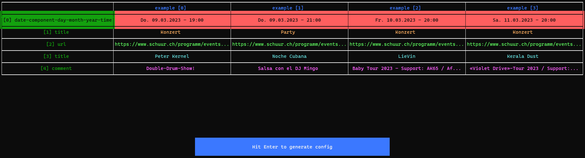

# concertcloud.live configuration

This repository contains the configuration for [concertcloud.live](https://concertcloud.live). concertcloud.live is a website that helps you find concerts worldwide. The data is gathered with [goskyr](https://github.com/jakopako/goskyr), a configurable command-line
scraper written in go. Twice a week goskyr runs through a Github action using `concert-config.yml` as configuration file and updates the concert database.

Despite the fact that there are other websites that offer an overview about concerts and events (such as <https://www.songkick.com/>, <https://www.jambase.com/>, etc.) I found none that are complete and/or include smaller event locations that might only be known to locals. That's why I came up with this idea.

## Idea

The idea of making this repository public is to enable others to contribute to the configuration file and hence expand
the data available on [concertcloud.live](https://concertcloud.live). I might have a good knowledge about concert locations in my home town but there are other poeple (you?) that know better about other towns. Everyone that has a basic understanding of programming and html/css should be able to extend the configuration file in order for the scraper to include more concert locations.

## How to contribute

If you know a concert venue that you'd like to add to [concertcloud.live](https://concertcloud.live) just fork this repository, add a new config snippet and open a pull request to merge the newly added snippet into the main branch. Have a look at the [README of goskyr](https://github.com/jakopako/goskyr) to make yourself familiar with the configuration syntax. Looking at the existing configurations might also give you some hints about how to write your own.

### How to add a config snippet - step by step

We'll demonstrate the process for the location "Konzerthaus Schüür" with the url https://www.schuur.ch/programm/

1. **Install goskyr**

    [Download](https://github.com/jakopako/goskyr/releases/latest) the latest prebuilt binary from the [releases page](https://github.com/jakopako/goskyr/releases) and unpack into this directory. For other options check out the [install section](https://github.com/jakopako/goskyr/blob/main/README.md#installation) of goskyr's README.

1. **Generate initial config snippet**

    Since v0.2.5 goskyr provides functionality to automatically generate a config snippet for a given url. We're going to rely on this feature to generate an initial version of the configuration. Additionally, we're going to make use of the new machine learning feature that is available since goskyr v0.4.0 to give us a first prediction of the field names. Unfortunately, goskyr still lacks the ability to generate the *entire* configuration so we'll have to make some modifications afterwards.

    1. Run goskyr with the `-g` and `--model` flags

        

        In your terminal run `./goskyr -g  https://www.schuur.ch/programm/ --model concert-20230509-mod` You'll be presented with a table that shows different fields from the website with corresponding examples. In case you don't see the fields you'd expect from looking at the website there might be a couple of things you can try. Adding the option `-m` allows you to set a minimum number of occurences of the extracted fields (default is 20). Only fields that occur at least this many times are added to the table to filter out noise. In some cases though a list of items on a website may be shorter so you may want to decrease that number accordingly. A second thing that you could try is using the `-d` flag to render js. Note, that chrome needs to be installed for this to work.

    1. Select fields

        With the <kbd>↑</kbd> and <kbd>↓</kbd> arrow keys you can navigate through the rows and with the <kbd>return</kbd> key you can select or de-select a row (ie a field). In case there are many fields to select from the color coding can be useful by giving fields that are close to each other (in the html tree) a similar color. In our example case we can ignore the colors. Once you selected the fields that you want to extract from the website (in our example we select all fields except the one with `Party`/`Konzert`.. as values) press the <kbd>tab</kbd> key to navigate to the button below the table and press <kbd>return</kbd> to generate the configuration. Note that the predicted field names are probably not always correct but still should provide some help to finalize the configuration more quickly.

1. **Update the generated configuration accordingly**

    First, to get a feeling what data would be extracted with the previously generated configuration run `./goskyr`. In our case, this should print a number of json items containing concert info. Now that you have an idea of what data is scraped with the current configuration, we need to adapt a few things for this specific use case.

    1. Field names

        Most of the fields mentioned should be correctly named already due to the machine learning. Still you might have to do some renaming. In this specific case of 'Schüür' it sometimes happens that there are two `title` fields. Rename one to `comment`.

    1. Date field

        In the ideal case (as should be the case in our example) nothing needs to be done for the date field configuration. However, sometimes the automatic extraction algorithm makes mistakes in which case we need to correct the configuration. To better understand the date extraction read the section on the `Key: type` under **[Dynamic Fields](https://github.com/jakopako/goskyr#dynamic-fields)**.

    1. Additional fields

        Right now we only configured dynamic fields, ie fields whose values change depending on the scraped website. For [concertcloud.live](https://concertcloud.live) we also need a couple of static fields: `city`, `location`, `type` and `sourceUrl`. Check the huge config file `concert-config.yml` to find out how to configure those. If the mandatory fields are not present then the scraper won't be able to send the data to the api that feeds the website. Also note, that `type` should be a static field with 'concert' as value and `city` should be a static field with the city name in English.

    1. Check the output

        Run `./goskyr` again and check whether the output makes sense. If it does, change the value of the `name` field to the name of the location and copy the config snippet to `concert-config.yml`. The example location has already been added to the configuration file so you can see the final version there.

1. **Make a pull request**

## Limitations

There are still a few limititions that will be solved in the future and include the following but might not be limited to:

- a field (type `text` & `url`) can only have one selector across all items of one concert location.
- if you encounter any other bugs or limitations feel free to open an issue in the [goskyr](https://github.com/jakopako/goskyr) repo.
